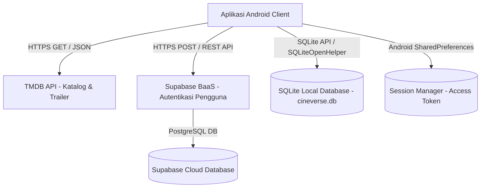
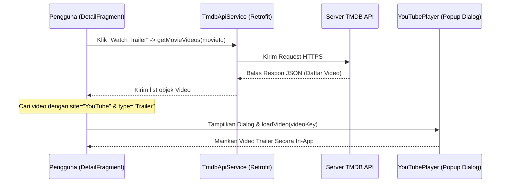
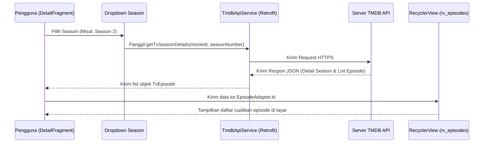

# 🎬 LAPORAN DOKUMENTASI TEKNIS MENDALAM: CINEVERSE
**Mata Kuliah: Praktikum Pemrograman Aplikasi Bergerak (PAB)**  
**Dosen Penguji / Asisten Praktikum PAB**

---

## 1. PENDAHULUAN & DESKRIPSI PROYEK
**Cineverse** adalah aplikasi eksplorasi film, serial TV, dan anime berbasis sistem operasi Android yang dikembangkan secara native menggunakan bahasa pemrograman **Kotlin**. Aplikasi ini dirancang untuk menyelesaikan masalah keterbatasan informasi multimedia terpadu dengan menyediakan katalog film global yang diperbarui secara asinkronus (real-time) melalui internet.

Aplikasi ini mengusung antarmuka pengguna premium modern, sistem pendaftaran akun berbasis cloud terpusat, fitur putar trailer video langsung di dalam aplikasi (in-app player), pencarian terpadu, dan daftar film favorit offline (*Watchlist*).

---

## 2. ARSITEKTUR SISTEM (HYBRID DUAL-STORAGE ARCHITECTURE)
Cineverse menerapkan arsitektur **Client-Server terdistribusi** dengan pendekatan **Hybrid Dual-Storage** (Penyimpanan Ganda). Sistem dirancang agar dapat mengonsumsi data dari berbagai API publik eksternal (TMDB dan Supabase) sekaligus mengelola penyimpanan internal perangkat secara efisien.



### Penjelasan Alur Arsitektur:
1.  **Client-Side (Android Frontend):** Menggunakan Kotlin sebagai pengolah logika pemrograman utama dan XML untuk struktur layout visual.
2.  **Katalog & Media API (TMDB):** Bertindak sebagai *content provider* eksternal yang menyuplai poster gambar, cuplikan video, ulasan, daftar aktor, serta rincian season dan episode.
3.  **Backend-as-a-Service (Supabase Auth Cloud):** Mengambil peran server backend untuk menangani pendaftaran akun baru, verifikasi login, enkripsi password, dan penyimpanan database user terpusat di cloud.
4.  **Local Storage (SQLite & SharedPreferences):**
    -   **SQLite Database:** Menyimpan data bookmark watchlist secara offline di perangkat pengguna.
    -   **SharedPreferences:** Menyimpan token sesi masuk pengguna agar status login tetap aktif (*Persistent Session*) saat aplikasi ditutup dan dibuka kembali.

---

## 3. FRONTEND DETAIL (ANDROID NATIVE APPS)

### A. Desain UI/UX & Desain Sistem (Desain Premium)
-   **Skema Warna:** Mengadopsi *Midnight Dark Theme* (Warna latar gelap dengan kode `#0F0F1E`) dipadukan dengan warna aksen emas-amber (`#FFB300`) dan ungu-neon untuk menciptakan visual bioskop digital yang modern.
-   **Karakteristik Elemen:** Menerapkan efek *Glassmorphism* (kartu dan bar navigasi transparan dengan bayangan halus) serta *Card Rounded Corners* (sudut tumpul yang elegan sebesar `12dp` sampai `16dp`).
-   **Tipografi:** Memakai Google Fonts khusus (seperti Inter/Outfit) yang diintegrasikan langsung pada resource tema XML.

### B. Struktur Halaman & Alur Navigasi (Jetpack Navigation)
Aplikasi ini dibangun menggunakan arsitektur **Single Activity** (`MainActivity`) yang memuat Fragment dinamis menggunakan komponen **Jetpack Navigation** (`nav_graph.xml`). Berikut rincian 10 halaman yang saling terhubung:

1.  **SplashFragment:** Menampilkan logo pembuka aplikasi, memeriksa status token sesi di `SessionManager`, dan mengarahkan pengguna secara otomatis ke *HomeFragment* jika sudah masuk, atau ke *LoginFragment* jika belum.
2.  **LoginFragment:** Menyediakan form input Email dan Password. Ketika tombol "Masuk" diklik, aplikasi melakukan asinkronus call ke Supabase API.
3.  **RegisterFragment:** Menyediakan form Username, Email, dan Password. Memiliki validasi password minimal 6 karakter.
4.  **HomeFragment (Dashboard):** Pusat konten utama yang menampilkan:
    -   *Carousel Banner* film terpopuler saat ini.
    -   *RecyclerView horizontal* untuk kategori Film yang Sedang Tayang (*Now Playing*), Film Populer (*Popular Movies*), dan Film Rating Tertinggi (*Top Rated*).
    -   *RecyclerView horizontal* untuk Serial TV Populer dan Anime Jepang (Discover TV Show dengan filter genre Animasi dan bahasa Jepang).
5.  **ExploreFragment (Pencarian Terpadu):** Kolom pencarian dinamis berbasis input teks untuk mencari film, serial, atau anime secara global dari TMDB secara asinkron.
6.  **DetailFragment (Informasi Terperinci):**
    -   Menampilkan poster besar, rating angka, sinopsis, daftar aktor (`rv_cast`), dan tombol kelola watchlist.
    -   Menyediakan tombol **"Watch Trailer"** untuk memutar cuplikan video.
    -   Khusus untuk kategori TV Show/Anime, menampilkan total season/episode, Spinner dropdown pemilih Season, dan `rv_episodes` untuk daftar episode.
7.  **ActorDetailFragment (Detail Tokoh):** Menampilkan foto profil aktor, biografi, biodata lahir, serta daftar film yang pernah dibintangi aktor tersebut.
8.  **WatchlistFragment (Daftar Favorit):** Menampilkan daftar film/serial yang telah di-bookmark pengguna dari database SQLite lokal. Dilengkapi tombol hapus cepat dari watchlist.
9.  **ProfileFragment (Profil Pengguna):** Menampilkan avatar, nama pengguna, email aktif, foto avatar yang diambil dinamis dari generator avatar atau galeri ponsel, dan tombol Keluar (*Logout*).
10. **SettingsFragment (Pengaturan):** Menyediakan kontrol untuk mengubah username & email, memilih foto profil dari galeri, mengubah bahasa aplikasi (Inggris / Indonesia), dan mengaktifkan saklar Mode Gelap.

### C. Libraries & Dependensi Frontend
-   **Retrofit2 & Gson Converter:** Berfungsi untuk melakukan koneksi HTTP Client ke TMDB API dan Supabase API secara asinkronus, serta mem-parsing data JSON dari server menjadi objek Kotlin (`data class`).
-   **Glide:** Pustaka pengolah gambar untuk mengunduh poster film dari server TMDB, melakukan *caching* otomatis, memotong gambar bulat (circle crop) untuk avatar profil, dan menampilkannya di ImageView.
-   **Android YouTube Player (`android-youtube-player`):** Pustaka ringan pemutar video YouTube native berbasis WebView. Digunakan untuk memainkan trailer video langsung di dalam aplikasi melalui jendela dialog popup tanpa membebani RAM HP.
-   **Kotlin Coroutines (lifecycleScope):** Digunakan untuk menangani eksekusi kode di luar thread utama (*background thread*) agar pemanggilan jaringan API tidak membekukan antarmuka pengguna (*UI Freeze*).

---

## 4. BACKEND-AS-A-SERVICE (SUPABASE CLOUD BAAS)
Cineverse menggunakan platform cloud server **Supabase** untuk mengelola autentikasi pengguna secara aman tanpa menulis server PHP/NodeJS manual:

-   **Otentikasi Pengguna:** Supabase Auth menggunakan engine **GoTrue** yang mengekspos REST API endpoints. Aplikasi Android menembak endpoint berikut via Retrofit:
    -   **Register:** `POST /auth/v1/signup`
    -   **Login:** `POST /auth/v1/token?grant_type=password`
-   **Sesi JWT (JSON Web Token):** Saat login sukses, Supabase membalas dengan objek JSON yang berisi `access_token` JWT. Token ini disimpan lokal oleh `SessionManager` dan digunakan sebagai "kunci akses" terenkripsi.
-   **Email Providers Bypass:** Pengaturan *Confirm email* dinonaktifkan di dashboard Supabase agar pengguna baru dapat langsung masuk setelah mendaftar tanpa perlu memverifikasi tautan di kotak masuk email mereka (efisien untuk pengujian praktikum).

---

## 5. SYSTEM DATABASE DESIGN (DUAL-STORAGE IMPLEMENTATION)

### A. Database Cloud (Supabase PostgreSQL)
Seluruh data akun pengguna disimpan di cloud database PostgreSQL milik Supabase. 
-   **Skema Tabel:** Menggunakan tabel sistem bawaan `auth.users` yang menyimpan kolom:
    -   `id` (uuid, Primary Key)
    -   `email` (varchar, Unique)
    -   `encrypted_password` (varchar, Hashed)
    -   `raw_user_meta_data` (jsonb, Menyimpan nama pengguna/username kustom)
-   **Keunggulan:** Akun pengguna dapat diakses secara global. Pengguna yang mendaftar dari HP A dapat masuk ke akunnya melalui HP B karena datanya disimpan secara cloud.

### B. Database Lokal (SQLite)
Aplikasi menyimpan data Watchlist (bookmark) secara lokal di memori internal perangkat menggunakan SQLite.
-   **Nama Database:** `cineverse.db`
-   **Nama Tabel:** `watchlist`
-   **Skema Tabel SQLite:**
    ```sql
    CREATE TABLE watchlist (
        id INTEGER PRIMARY KEY AUTOINCREMENT,
        movie_id INTEGER UNIQUE,
        title TEXT,
        poster_path TEXT,
        rating REAL,
        release_date TEXT,
        media_type TEXT DEFAULT 'movie'
    );
    ```
-   **Keunggulan:** Pengguna tetap dapat melihat daftar film favorit mereka bahkan saat tidak memiliki koneksi internet sama sekali (*offline compatibility*).

---

## 6. INTEGRASI API PUBLIK (TMDB PUBLIC API)
Cineverse terhubung ke **The Movie Database (TMDB) API v3** untuk menyajikan data katalog multimedia global.

### Endpoint Utama yang Dikonsumsi:
1.  `GET /movie/now_playing` : Mengambil daftar film yang sedang tayang di bioskop saat ini.
2.  `GET /movie/popular` & `GET /tv/popular` : Mengambil film dan serial TV terpopuler.
3.  `GET /movie/top_rated` & `GET /tv/top_rated` : Mengambil film dan serial TV dengan rating tertinggi.
4.  `GET /movie/{id}` & `GET /tv/{id}` : Mengambil informasi detail spesifik film/serial (termasuk properti baru `number_of_seasons` dan `number_of_episodes`).
5.  `GET /movie/{id}/videos` & `GET /tv/{id}/videos` : Mengambil daftar video klip terkait film/serial untuk mencari key trailer YouTube.
6.  `GET /tv/{id}/season/{season_number}` : Mengambil daftar lengkap judul, nomor, gambar cuplikan, dan sinopsis episode untuk season tertentu.
7.  `GET /search/multi` : Mencari kecocokan judul film, serial, dan aktor berdasarkan kata kunci yang diketik pengguna.

---

## 7. DIAGRAM ALUR DATA (DATA FLOW DIAGRAM)

### A. Alur Pemutaran Trailer Video (Watch Trailer)


### B. Alur Pemilihan Season & Episode TV Show

